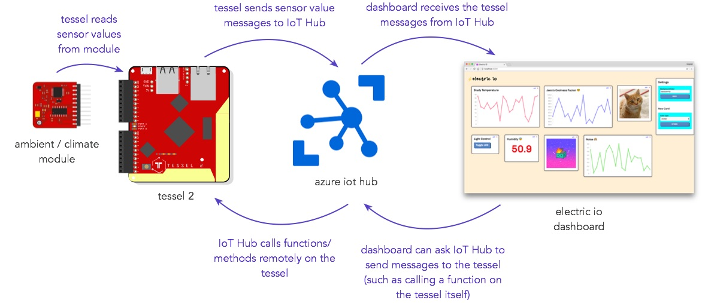
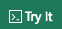
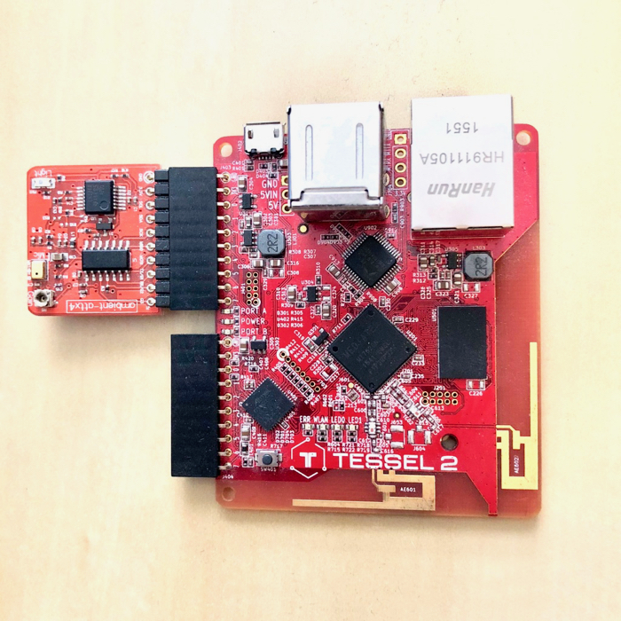
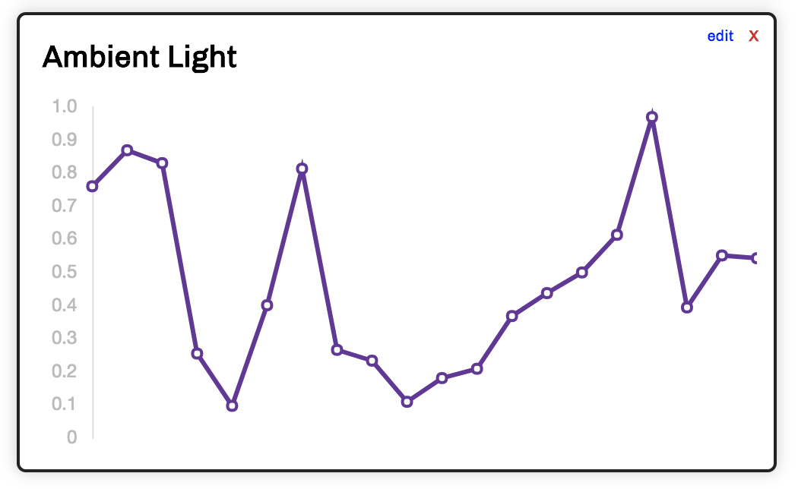
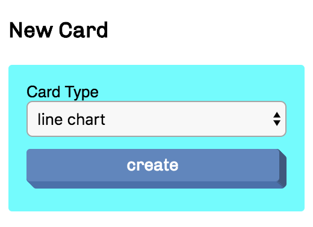
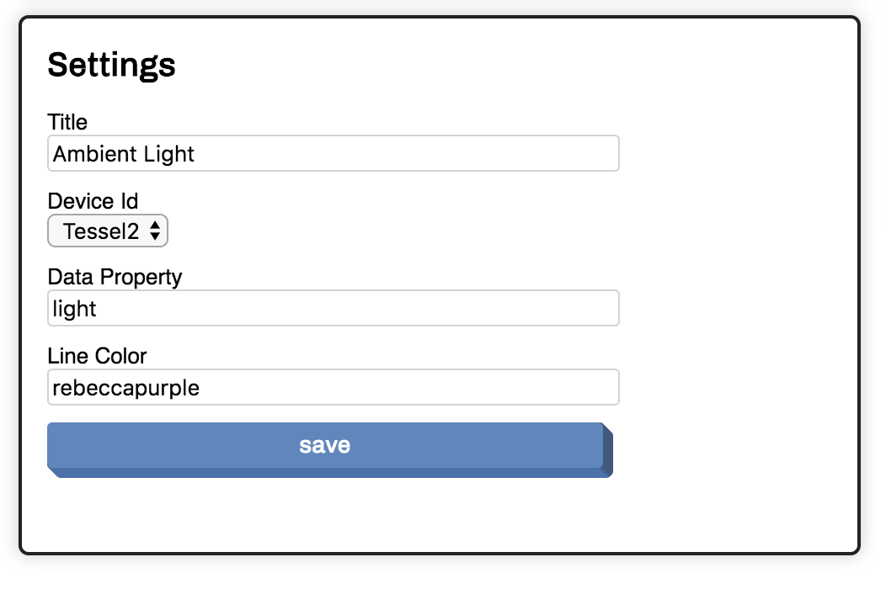
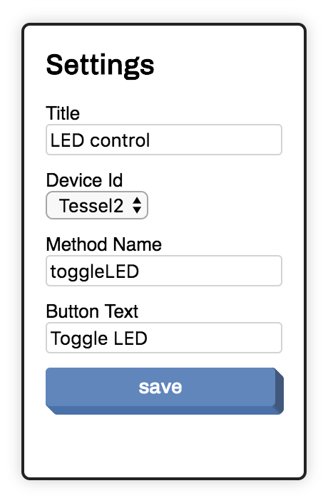
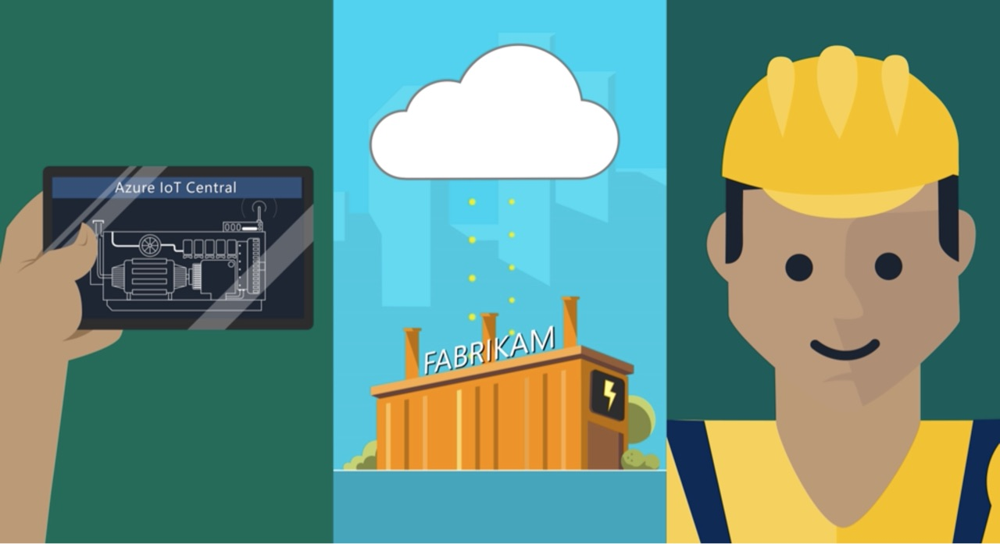

# Welcome to the Tessel IoT Dashboard Workshop 🎉

We're glad you're here. It's going to be a fun couple of hours! This self-led guide aims to walk you through completing your first Tessel IoT project ⚡️📉 📋 

🙋‍♀️🙋‍♂️ If you need help at any point during this workshop, do not hesitate to ask your friendly coaches.

## Sections

1. [How it all works](#how-it-all-works)
2. [Installing Software](#installing-software)
3. [Setting up your Tessel for use](#setting-up-your-tessel-for-use)
4. [Creating your Azure account](#creating-your-azure-account)
5. [Creating your IoT Hub](#creating-your-iot-Hub)
6. [Registering your Tessel in IoT Hub](#registering-your-tessel-in-iot-hub)
7. [Gathering data from your Tessel Module](#gathering-data-from-your-tessel-module)
8. [Creating your IoT Dashboard](#creating-your-iot-dashboard)
9. [Bonus challenges!](#bonus-challenges)
10. [Going even further - IoT Central](#going-even-further-iot-central)

## How it all works

The following diagram shows a high level explanation of what we're building today, and what all of the different pieces do.



If you'd like more in-depth information on what Azure IoT Hub is, and what it can do, [check out the docs](https://docs.microsoft.com/en-us/azure/iot-hub/about-iot-hub?wt.mc_id=IoTTesselWS)!

## Installing Software

1. [Install NodeJS](https://nodejs.org) (we recommend the current LTS version)
2. [Install the Tessel CLI](http://tessel.github.io/t2-start/)

If you've already done these two things, hooray! Skip on to the next section!

## Setting up your Tessel for use

Follow the steps on the [Tessel website](https://tessel.github.io/t2-start/) to do the following:

1. [Find your Tessel](https://tessel.github.io/t2-start/)
2. [Connect your Tessel to the Wifi](https://tessel.github.io/t2-start/wifi.html)
3. [Authorize your Tessel](https://tessel.github.io/t2-start/wifi.html)

Your Tessel should be ready to go now.

## Creating your Azure account

Creating an Azure account is free, and allows you to set up an IoT Hub, which is a magical service to receive messages from your Tessel, and even send messages back to it! 📞

Visit [microsoftazurepass.com](https://www.microsoftazurepass.com/Home/HowTo) and follow the steps on this page to use your Azure Pass. 


## Creating your IoT Hub

⚠️ **Important: choose the free tier (F0) when you create your IoT Hub**.

Visit [this guide](https://docs.microsoft.com/en-us/azure/iot-hub/iot-hub-create-through-portal) on how to create a new Azure IoT Hub and follow the steps. Stop once your IoT Hub is created and you get to 'Change the settings of the IoT hub'.  You can ignore all other steps on that page.

## Registering your Tessel in IoT Hub

In order for your Tessel to communicate with IoT Hub, we'll need to register it as a device first so that IoT Hub knows it's allowed to talk to it. 🔒 Security first!

1. Follow the [device registration guide](https://docs.microsoft.com/en-us/azure/iot-hub/quickstart-send-telemetry-node#register-a-device?wt.mc_id=IoTTesselWS), **following steps 1 and 2 only** by clicking the "Try It" button in the first command snippet in step 1. It looks like this:  


2. After step 2 is completed, **copy the connection string that is printed to the console and store it somewhere safe**, such as in a local text file (keep it private!). The connection string you're looking for should look something like this: `HostName=myiothub.azure-devices.net;DeviceId=MyNodeDevice;SharedAccessKey=12345567b=`

🔑 This connection string will be used in your Tessel's code later on, so keep that file around!


## Gathering data from your Tessel Module

You should have either an Ambient Module or a Climate Module to use with your Tessel. The module should be clearly labeled in order for you to discover which one it is. *If you want a different module, try swapping with another workshop buddy!*

🔑 The [modules page](https://tessel.github.io/t2-start/modules.html) on the Tessel website briefly introduces modules and explains which way to plug them in to your Tessel. We're going to use **Port A** today.

The diagram below shows the correct port and orientation of the ambient module:




### Ambient Module

Plug your Ambient Module into Port A on your Tessel.

The base code we're going to use for the Tessel with your Ambient Module can be found in this repo under [content/examples/ambient/index.js](https://github.com/noopkat/tessel-workshop/blob/gh-pages/content/examples/ambient/index.js). Open this file locally in your code editor to get started.


### Climate module

Plug your Climate Module into Port A on your Tessel.

The base code we're going to use for the Tessel with your Climate Module can be found in this repo under [content/examples/climate/index.js](https://github.com/noopkat/tessel-workshop/blob/gh-pages/content/examples/climate/index.js). Open this file locally in your code editor to get started.

### Getting the code ready

Both files contain a variable named `connectionString`. Remember what we copied into a text file earlier on? This is the tessel's device connection string! Copy and paste that as the value of the `connectionString` variable.


### Running the code

Your code is now ready to run on the Tessel! To deploy, make sure your Tessel is still on and connected. Use your terminal to navigate to the directory your code file is in, and run the following command:

```t2 run index.js```

You should eventually see your program run, and sensor readings will start pouring in on the console. Great! If you see any errors, grab the attention of a friendly workshop coach and they'll come help you 🙋‍♀️🙋‍♂️

Example of working terminal output:

```console
t2 run index.js
INFO Looking for your Tessel...
INFO Connected to nooptess.
INFO Building project.
INFO Writing project to RAM on nooptess (2617.344 kB)...
INFO Deployed.
INFO Running index.js...
Light level: 0.11328125
Sending message: {"light":0.11328125}
Light level: 0.11328125
Sending message: {"light":0.11328125}
Light level: 0.11230469
Sending message: {"light":0.1123046875}
Light level: 0.09277344
Sending message: {"light":0.0927734375}
Light level: 0.07031250
Sending message: {"light":0.0703125}
Light level: 0.05468750
Sending message: {"light":0.0546875}

```

If everything looks okay, stop the program by pressing Ctrl+C in your terminal.

## Creating your IoT Dashboard

1. Follow [Step 3 only](https://docs.microsoft.com/en-us/azure/iot-hub/quickstart-control-device-node#register-a-device?wt.mc_id=IoTTesselWS) of 'Register a device' and copy the connection string that is output, again to a local text file. ⚠️ **This connection string is different to the one you copied earlier for the Tessel!** This connection string allows us to listen for incoming device telemetry, and also lets us to get a list of devices registered with your IoT Hub.
2. Create an account on [Glitch.com](https://glitch.com)
3. Navigate to [electric-io.glitch.me](https://electric-io.glitch.me) and click the 'Remix on Glitch' button.
4. Open the `.env` file in the root of the file tree, and look for a property called `CONNECTION_STRING`. Paste in this new connection string as the value.
5. Click the 'Show Live' button near the top of the Glitch editor. You'll see a friendly looking page, with not that much on it yet.

### Adding a new card



To add a new 'card', use the settings panel on the right. Choose 'Line Chart' as the card type, then click the 'Create' button. A new card will appear in the top left corner. If you don't like where it is positioned, you can drag and drop it elsewhere.



To connect your line chart card with the sensor reading your Tessel is sending to IoT Hub, click the 'edit' button in the top right of the card. Ensure that the device id is the name of the device we registered earlier in IoT Hub (it'll most likely autofill this for you). Then, type the property name that your tessel code was using in the telemetry message it is sending to IoT Hub. Hint: for ambient, this will be `light`, and for climate, this will be `temperature`.

You can optionally change the title of the card, and the color of the chart line. When done, click on 'Save'.




### Testing it all out

Back in your terminal, type the same command as before to run your program on the Tessel. To recap, it is:

```t2 run index.js```

If it successfully starts up, go back to your dashboard to see if your line chart card begins to show live data! Try influencing the readings to see the chart update live, such as breathing warm air on the climate module, or covering up the ambient module with your hand to block out its access to light. 

## Bonus challenges!

### Create a button card to control your Tessel's LED light

To add a new 'card', use the settings panel on the right. Choose 'Button' as the card type, then click the 'Create' button. A new card will appear in the top left corner. If you don't like where it is positioned, you can drag and drop it elsewhere.

To connect your button card with the your Tessel, click the 'edit' button in the top right of the card. Ensure that the device id is the name of the device we registered earlier in IoT Hub (it'll most likely autofill this for you). Then, type the function/method name that your tessel code was listening for in the code. Spoiler: it's called `toggleLED` !

You can optionally change the title of the card and the text on the button too. When done, click on 'Save'.



Try clicking the button to see what happens, and watch your Tessel board closely when you click it! Did an LED light up? What does clicking the button again do?

### Add new code to report an additional sensor

Your Tessel module should have more than one sensor on it. Using the documentation for your module ([ambient](https://www.npmjs.com/package/ambient-attx4) and [climate](https://www.npmjs.com/package/climate-si7020)), can you add another property to the message your Tessel is sending? Can you then create a new card and connect it to that new sensor property to show the live value?

Some ideas:

1. Using the climate module, try reporting the humidity and displaying that on your dashboard alongside the temperature.
2. Using the ambient module, try reporting sound readings and displaying that on your dashboard alongside the light.


## Going even further - IoT Central

Electric IO is a basic dashboard to get you started. However, you might find yourself needing a more professional and robust solution as you expand your device collection and find need to juggle lots of different telemetry messages. Microsoft has a fully managed SaaS offering as part of Azure called [IoT Central](https://www.microsoft.com/en-us/iot-central?wt.mc_id=IoTTesselWS), which we highly recommend you check out! The in-depth docs are super informative and available at [our official docs site](https://docs.microsoft.com/en-us/azure/iot-central?wt.mc_id=IoTTesselWS). There'll you'll find an overview, quickstarts and more!
We'd love your feedback on it 💙

[](https://www.microsoft.com/en-us/iot-central?wt.mc_id=IoTTesselWS)
